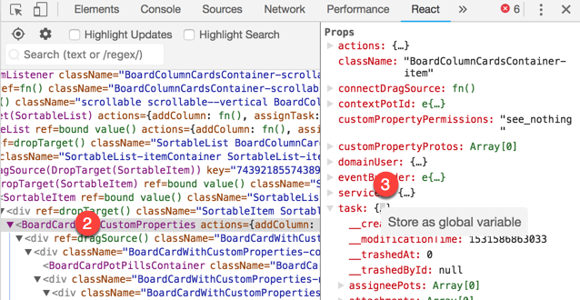
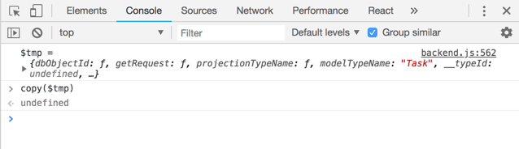

While working on a React project today, I was looking to copy a property that
was passed down to a component. After searching around, I found out it's
surprisingly easy.

<!--more-->

1. Open up the
   [React Developer Tools](https://chrome.google.com/webstore/detail/react-developer-tools/fmkadmapgofadopljbjfkapdkoienihi?hl=en)
   tab within the Chrome inspector.
   
1. Select the component or element which contains the property you want to copy.
   
1. Right-click the `{…}` and select **Store as global variable** from the menu.
1. Navigate to the console tab.
   
1. You will notice a global variable was added with a naming convention similar
   to `$tmp` or `temp1`.
1. Copy the value to your clipboard by typing `copy($tmp)` into the console.
   

What’s great about this trick is almost any value which has the `{…}` beside it
within the Chrome inspector can be set as a global variable. Therefore this
method is not limited to the React Developer Tools.
